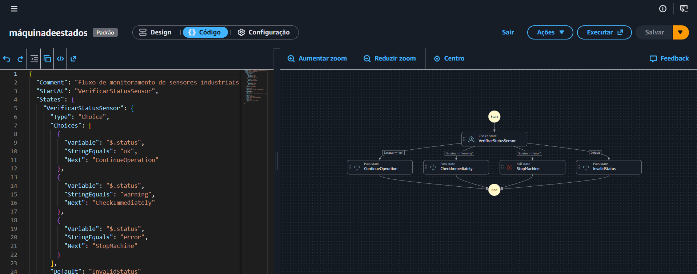

# Orquestração de Workflows Automatizados com AWS Step Functions 🚀

Repositório criado para consolidar os aprendizados sobre o **AWS Step Functions** no bootcamp da [DIO](https://www.dio.me/). Este projeto demonstra como coordenar múltiplos status de sensores industriais em fluxos de trabalho visuais, resilientes e fáceis de monitorar de forma totalmente serverless.

---

## 🧠 O que é o AWS Step Functions?

O **AWS Step Functions** é um orquestrador de fluxos de trabalho serverless que permite combinar funções do AWS Lambda e outros serviços da AWS para criar aplicações essenciais para os negócios. Através de máquinas de estados visuais baseadas em ASL (Amazon States Language), conseguimos definir sequências, ramificações (paralelismo), condições e tratamentos de erros de forma nativa.

---

## 🏗️ O Workflow Desenvolvido

Neste laboratório, simulei um fluxo de monitoramento de sensores industriais em tempo real. O sistema recebe o status de uma máquina fornecido por sensores inteligentes e determina a ação recomendada para os operadores da fábrica.

### Arquitetura / Fluxo Visual

---

## 🛠️ Componentes e Estados Utilizados

No desenvolvimento da máquina de estados, utilizei os seguintes conceitos da estrutura ASL:

- **Choice State (Estado de Escolha):** Adiciona lógica condicional baseada na entrada `$.status`.
- **Pass State (Estado de Passagem):** Utilizado nos caminhos bem-sucedidos para retornar mensagens como `"Continue operation"` (status ok) ou `"Check immediately"` (status warning).
- **Fail State (Estado de Falha):** Acionado quando o status do sensor retorna `"error"`, simulando uma parada crítica imediata da máquina da fábrica.

---

## 💡 Principais Insights e Aprendizados

Durante a prática, os pontos mais relevantes observados foram:

1. **Separação de Responsabilidades:** O Step Functions elimina a necessidade de codificar a lógica de tomada de decisões condicionais complexas dentro do código principal da aplicação, deixando o fluxo visível para toda a equipe técnica.
2. **Resiliência Serverless:** Não há necessidade de gerenciar servidores ou infraestrutura para monitorar o status; a escalabilidade e execução do fluxo são totalmente controladas pela AWS.
3. **Monitoramento Visual Prático:** A console da AWS permite rastrear exatamente qual caminho o input do sensor seguiu, facilitando a auditoria e o debug do sistema industrial em tempo real.

---

## 👨‍💻 Autor

Desenvolvido por **Nicolas Aires**.
